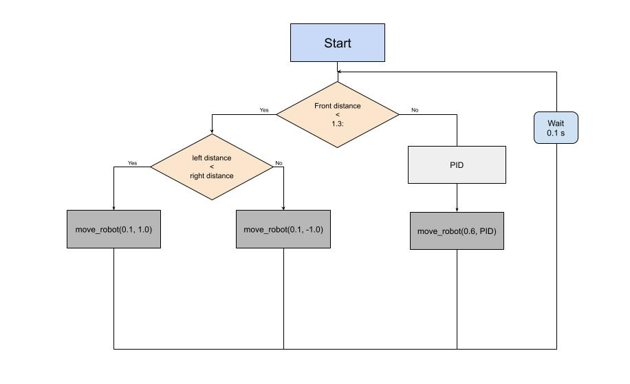

# IR-2025-g11-pedro-marti
Intelligent Robotics 2025 (UPC-EEBE) – Group 11: Repository for all coursework, including lab work, assignments, and the final project.
________________________________________________________________________________________
## Contents of each session

This repository contains all the code and files developed during the lab and project sessions. Each session focuses on different aspects of robotics and ROS:

  - Session 1: Introduction to Linux, Git/GitHub, and basic Python scripting.
  
  - Session 2: Creation and visualization of the robot model using URDF.
  
  - Session 3: Simulation and visualization of the robot in RViz and Gazebo.
  
  - Session 4: ROS nodes development (publisher/subscriber) and simulation of the robot equipped with LiDAR and IMU sensors.
  
  - Session 5: Project
  
  - Session 6: Project
  
  - Session 7: Project
_______________________________________________________________________________________
## Repository structure:
```
ir_ws/
├── src/
│   ├── session1/                     # ROS 2 basic scripts (.bash and Python)
│   ├── session2/                     # URDF description and robot design
│   │   ├── my_robot.urdf             # Differential robot model
│   │   └── project/                  # JPL Rover with IMU and LiDAR
│   │       └── osr_gazebo/
│   │           └── urdf/osr_simplified.urdf.xacro
│   ├── session3/                     # Robot launch and simulation
│   │   ├── my_robot_description/     # URDF, RViz config, and launch files
│   │   │   ├── urdf/                 # URDF model with inertial and collision data
│   │   │   ├── rviz/                 # RViz visualization configuration
│   │   │   └── launch/               # Launch scripts for RViz and Gazebo
│   │   └── my_robot_bringup/         # Launch file for combined Gazebo + RViz
│   ├── session4/                     # Publisher and subscriber ROS 2 nodes
│   │   ├── src/                      # Node scripts (publisher.py, subscriber.py)
│   │   └── launch/                   # Launch file for robot with sensors
│   └── project/                      # Contains all the files of the project
│       ├── Project/                  # Project package
│       ├── osr_bringup/              # Launch file
│       └── osr_gazebo/               # Launch file
```

________________________________________________________________________________________

## Instructions
   
How to run the code:

  - Session 1:
    - Execute the bash script, if execution rights are already given:
      ```
      ./my_script.sh 
          (if execution rights are not given, then: chmod +x ./my_script.sh)
      ```
    - Run the Python script
      ```
      python3 my_script.py
      ```
  - Session 2:
    - Visualize the robot in RViz
      ```
      ros2 launch urdf_tutorial display.launch.py model:=$(pwd)/my_robot.urdf
      ``` 
    - To open the JPL Rover model
      ```
      ros2 launch urdf_tutorial display.launch.py model:=$(pwd)/osr_simplified.urdf.xacro
      ```
        
  - Session 3:
    - Launch RViz (visualization only)
      ```
      ros2 launch my_robot_description display.launch.py
      ```
    - Launch Gazebo + RViz
      ```
      ros2 launch my_robot_bringup my_robot.launch.py
      ```
    - Control the robot with the keyboard
      ```
      ros2 run teleop_twist_keyboard teleop_twist_keyboard
      ```
  - Session 4:
    - Run the publisher node:
      ```
      ros2 run diff_robot lidar_publisher
      ```
    - Run the subscriber node:
      ```
      ros2 run diff_robot decision_subscriber
      ```
    - To show the messages of a topic:
      ```
      ros2 topic echo left_sensor
      ```
  - Project:
    - Launch the simulation in Gazebo (choose one of the three maps):
      ```
      ros2 launch osr_bringup maze_simulation.launch.py maze:=maze_1.world
      ```
      ```
      ros2 launch osr_bringup maze_simulation.launch.py maze:=maze_2.world
      ```
      ```
      ros2 launch osr_bringup maze_simulation.launch.py maze:=maze_3.world
      ```
    - Run the node:
      ```
      ros2 run Project BrainNode
      ```
________________________________________________________________________________________
## Project
This project focuses on the autonomous navigation of the JPL Open Source Rover using ROS 2. 
The rover is simulated in Gazebo and equipped with a LiDAR sensor to perceive its environment. 
A custom ROS 2 Python node (in our case BrainNode) processes LiDAR data from the /scan topic and publishes velocity commands to /cmd_vel.
The goal is to navigate autonomously through maze environments while staying centered, avoiding obstacles, and maintaining smooth motion.
The project integrates robot modeling, simulation, sensing, decision-making, and control within a single ROS 2 workspace.
### Choosen solution
We decided to implement a PID controller to manage the robot's motion, as it provides a simple solution without the need to integrate 
more complex path-planning algorithms, such as A or RRT, due to our limited lab time.

Therefore, we created a PID class, which contains two methods. The first is the constructor (__init__), which initializes the PID 
coefficients and internal state variables. The second method, compute, calculates the control output based on the current error by 
applying the proportional, integral, and derivative terms.

```python
class PID:
    def __init__(self, Kp, Ki, Kd):
        self.Kp = Kp
        self.Ki = Ki
        self.Kd = Kd
        self.prev_error = 0
        self.integral = 0

    def compute(self, error):
        P = self.Kp * error
        self.integral += error
        I = self.Ki * self.integral
        D = self.Kd * (error - self.prev_error)
        self.prev_error = error
        return P + I + D
```

Then, in the node responsible for deciding the robot's motion, the PID class is instantiated with the following specific values:
```python
self.pid = PID(Kp=0.3, Ki=0.0, Kd=0.12)
```
After many tests, these values ensure that the robot can successfully navigate the maze smoothly.
We achived low osclitaions in straight corridors thanks to the derivative component of the PID.
Although the robot osciles a little bit, it is able to complete all the three maps without colliding.

Every time a message is received on the /scan topic (to which we are subscribed), the scan_callback method is executed.
For the front distance, it is used the sector_min function because what matters is the minimum distance to an obstacle to avoid collisions."
Otherwise, for lateral distances, we use the mean value within a 20° sector. As shown below:

```python
def scan_callback(self, msg):
self.ranges = msg.ranges
n = len(msg.ranges)

# Indices determined using a small script
front_index = 180
right_index = 90
left_index  = 270

# Each sector ±10 lectures
sector_width = 10

# Function to calculate the mean, without including 0 or None values
def sector_mean(ranges, center, width): #ranges: list of LIDAR values, center: central index, width: lectures done each side from the center
    sector = []
    for i in range(center - width, center + width): #iteration of the sector selected (from: center - width, to: center + width)
        val = ranges[i % n]
        if val is not None and val > 0:
            sector.append(val)
    if not sector:
        return msg.range_max
    return sum(sector)/len(sector)

# Function for the front, it return the lowest distance in the observed sector 
def sector_min(ranges, center, width):
    sector = []
    for i in range(center - width, center + width):
        val = ranges[i % n]
        if val is not None and val > 0:
            sector.append(val)
    if not sector:
        return msg.range_max
    return min(sector)

# Distances calculation
self.front = sector_min(self.ranges, front_index, sector_width)
self.right = sector_mean(self.ranges, right_index, sector_width)
self.left  = sector_mean(self.ranges, left_index, sector_width)
```

The decission-making function (comparation) it's called each 0.1 secconds, as it is fixed in the node class:
```python
self.timer = self.create_timer(0.1, self.comparation)
```

The comparation function implements the following logic. First, the error is calculated as the difference between the left and right distances. Then, the compute method of the PID returns a value, which is stored in the variable correction. If the robot's front is far enough from a wall it moves at a 0.6 of linear speed, and the angular speed corresponds to correction. This correction in the angular speed allows the robot to stay approximately in the center of the corridor. In the case that the robot detect an object, there are two possibilites: if the left distance is bigger than right it will rotate a constant angular speed of -1.0, and viceversa for the other case. However, during the rotation movement it has a low linear speed because we observed that can avoid situations in which the robot gets stuck.  


```python
    def comparation(self):
        self.get_logger().info(f"R:{self.right:.2f} L:{self.left:.2f} F:{self.front:.2f}")

        # Control PID lateral
        error = self.left - self.right
        correction = self.pid.compute(error)

        # Mover el robot
        if self.front < 1.3:
            if self.right>self.left:
                self.move_robot(0.1, -1.0)
            else:
                self.move_robot(0.1, 1.0)
               
        else:
            self.move_robot(0.6, correction)
```

In short, these are the key aspects of the logic behind our algorithm.

The flowchart is shown below:

________________________________________________________________________________________
## Result

Below, the three videos corresponding to the three maps in which the robot had to navigate are attached:
<p>Below, the three videos corresponding to the three maps in which the robot had to navigate are attached:</p>
<ul>
  <li><a href="https://drive.google.com/file/d/1nYyqDzvi8mtQTIMkQfssEf0v9_7DjhVQ/view?usp=drive_link" target="_blank">MAP 1</a></li>
  <li><a href="https://drive.google.com/file/d/1nYyqDzvi8mtQTIMkQfssEf0v9_7DjhVQ/view?usp=drive_link" target="_blank">MAP 2</a></li>
  <li><a href="https://drive.google.com/file/d/1nYyqDzvi8mtQTIMkQfssEf0v9_7DjhVQ/view?usp=drive_link" target="_blank">MAP 3</a></li>
</ul>

________________________________________________________________________________________
## Conclusions

This project has been extremely valuable and interesting. We have learned how to implement a PID controller for a mobile robot to navigate through mazes, how to process LIDAR data to detect obstacles and measure distances, and how to combine sensor information with control algorithms to achieve smooth and reliable motion.

In parallel, we also improved our skills in Python programming, version control with Git, and using the Linux environment, which were essential for managing the project and working effectively with ROS2.

Overall, the project has been very complete and challenging. It has also given us insight into robot behavior in real environments.

We found the experience highly rewarding, as it provided both technical learning and practical problem-solving skills, making the project engaging.
